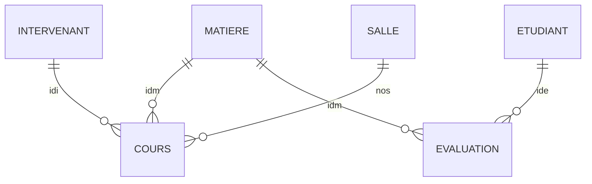

# 📚 TP2 OLAP — Explication complète pour le contrôle

> [!TIP]
> Ce document explique **chaque question du TP** de manière simple. Lis-le comme un cours, pas comme un corrigé à recopier. L'objectif est que tu **comprennes la logique** pour ton contrôle papier.

---

## 🗄️ Comprendre la base de données d'abord

Avant de toucher les requêtes, il faut comprendre **les tables** et **comment elles sont liées**.

### Les 6 tables

| Table | Rôle | Clé primaire | Colonnes importantes |
|---|---|---|---|
| `matiere` | Les matières enseignées | `idm` | `intitule` (nom), `nbs` (nombre de séances **prévues**) |
| `intervenant` | Les enseignants | `idi` | `nom`, `prenom`, `statut` ('P'=permanent, 'V'=vacataire) |
| `etudiant` | Les étudiants | `ide` | `nom`, `prenom`, `groupe` ('G1', 'G2', 'G3') |
| `salle` | Les salles de cours | `nos` | `typs` (1=info, 2=TD), `contenance` |
| `cours` | Les séances **effectivement réalisées** | `(idm, nums, idi)` | `nos`, `groupe`, `dates`, `phor` ('AM'/'PM') |
| `evaluation` | Les notes des étudiants | `(idm, ide)` | `note` |

### Les relations entre tables (clés étrangères)



> [!IMPORTANT]
> **Distinction cruciale** : `matiere.nbs` = nombre de séances **prévues** (théorique). Le nombre de lignes dans `cours` pour une matière et un groupe = nombre de séances **effectivement réalisées**.

### Les données concrètes

- **3 matières** : BD1 (idm=11, 3 séances prévues), C++ (idm=12, 3 séances), PHP (idm=13, **4** séances)
- **8 intervenants** : Codd, Mirandol, Laka, Chettiti, Restenst, Carmigniac, Chauve, Martin
- **12 étudiants** : 4 en G1, 4 en G2, 4 en G3
- **6 salles** : E102 à E107 (+ E001 qui n'a pas de cours)
- **24 séances de cours** dans la table `cours`
- **36 notes** dans la table `evaluation` (12 étudiants × 3 matières)

---

## 🧠 Rappel des concepts du cours

Avant les requêtes, voici les **outils SQL** que tu vas utiliser :

### 1. CTE — `WITH ... AS`
C'est comme créer une **table temporaire** juste pour ta requête. Au lieu d'écrire une sous-requête compliquée dans le `FROM`, tu la nommes en haut.

```sql
WITH ma_vue AS (
    SELECT ... FROM ...
)
SELECT * FROM ma_vue;
```

**Analogie** : C'est comme donner un surnom à un calcul en maths. Au lieu de réécrire `(2x + 3y - z)` partout, tu dis « soit **A** = 2x + 3y - z » et ensuite tu utilises **A**.

### 2. Fonctions de fenêtrage — `OVER()`
Elles permettent de faire des calculs d'agrégats (SUM, MAX, AVG...) **sans perdre le détail des lignes**.

```sql
-- Avec GROUP BY : on perd le détail → une seule ligne par groupe
SELECT groupe, AVG(note) FROM evaluation GROUP BY groupe;

-- Avec OVER : on GARDE chaque ligne + on ajoute le calcul
SELECT ide, note, AVG(note) OVER(PARTITION BY groupe) FROM evaluation;
```

**Analogie** : Imagine une feuille d'appel avec tous les élèves. `GROUP BY` fait disparaître les noms pour ne garder que la moyenne du groupe. `OVER()` garde tous les noms ET ajoute la moyenne du groupe à côté de chaque nom.

### 3. Fonctions de classement
| Fonction | Comportement | Exemple (notes: 18, 17, 17, 15) |
|---|---|---|
| `ROW_NUMBER()` | Numérote les lignes (1, 2, 3, 4...) | 1, 2, 3, 4 |
| `RANK()` | Rang avec trous (ex-aequo = même rang, puis saut) | 1, 2, 2, **4** |
| `DENSE_RANK()` | Rang **sans trous** (ex-aequo = même rang, pas de saut) | 1, 2, 2, **3** |

### 4. GROUPING SETS / ROLLUP / CUBE
Ils permettent de faire **plusieurs GROUP BY différents** dans **une seule requête**.

```sql
-- GROUPING SETS : on liste explicitement les groupements voulus
GROUP BY GROUPING SETS((col1), (col2), ())
-- () = pas de groupement = total général

-- ROLLUP : combinaisons hiérarchiques
GROUP BY ROLLUP(a, b)  -- équivaut à GROUPING SETS((a,b), (a), ())

-- CUBE : toutes les combinaisons possibles
GROUP BY CUBE(a, b)    -- équivaut à GROUPING SETS((a,b), (a), (b), ())
```

---

## 📝 Question 1 — Notes maximales (GROUPING SETS)

### L'énoncé simplifié
> Affiche la note max **par étudiant**, puis **par intervenant**, puis **par matière**. Le tout en **une seule requête**.

### Pourquoi c'est un défi ?
Normalement, pour avoir « note max par étudiant », tu ferais `GROUP BY ide`. Pour « par intervenant », tu ferais `GROUP BY idi`. Ce sont **3 GROUP BY différents**. Comment les combiner en un ?

### Le concept du cours utilisé : `GROUPING SETS`
Le cours dit qu'avec `GROUPING SETS`, on peut lister plusieurs groupements dans une même requête.

### La requête

```sql
SELECT e.ide, e.nom AS nom_etudiant,
       i.idi, i.nom AS nom_intervenant,
       m.idm, m.intitule,
       MAX(ev.note) AS note_max
FROM tp2_olap.evaluation ev
JOIN tp2_olap.etudiant e USING(ide)
JOIN tp2_olap.cours c USING(idm)
JOIN tp2_olap.intervenant i USING(idi)
JOIN tp2_olap.matiere m ON m.idm = ev.idm
GROUP BY GROUPING SETS(
    (e.ide, e.nom),           -- groupement par étudiant
    (i.idi, i.nom),           -- groupement par intervenant
    (m.idm, m.intitule)       -- groupement par matière
);
```

### Explication ligne par ligne

1. **`SELECT`** : On sélectionne les infos de l'étudiant, de l'intervenant et de la matière, + la note max
2. **`FROM evaluation ev JOIN ...`** : On lie toutes les tables nécessaires pour avoir les noms
3. **`GROUP BY GROUPING SETS(...)`** : C'est la clé ! On dit à PostgreSQL :
   - D'abord, calcule `MAX(note)` en regroupant par `(ide, nom)` → note max par étudiant
   - Ensuite, calcule `MAX(note)` en regroupant par `(idi, nom)` → note max par intervenant
   - Enfin, calcule `MAX(note)` en regroupant par `(idm, intitule)` → note max par matière

> [!NOTE]
> Dans le résultat, quand on regroupe par étudiant, les colonnes `idi` et `idm` seront à `NULL` (car elles ne font pas partie de ce groupement). C'est normal ! C'est comme ça qu'on distingue les 3 blocs de résultats.

---

## 📝 Question 2 — Salle(s) avec le plus de séances (sous-requête / CTE)

### L'énoncé simplifié
> Quelle(s) salle(s) ont accueilli le **maximum** de séances de cours ? Afficher le numéro et la contenance.

### Le raisonnement en 2 étapes

**Étape 1** : Compter le nombre de cours par salle
**Étape 2** : Garder uniquement la/les salle(s) dont le compte = le maximum

### La requête

```sql
WITH nb_cours_par_salle AS (
    SELECT nos, COUNT(*) AS nb_cours
    FROM tp2_olap.cours
    GROUP BY nos
)
SELECT s.nos, s.contenance, n.nb_cours
FROM tp2_olap.salle s
JOIN nb_cours_par_salle n ON s.nos = n.nos
WHERE n.nb_cours = (SELECT MAX(nb_cours) FROM nb_cours_par_salle);
```

### Explication ligne par ligne

1. **`WITH nb_cours_par_salle AS (...)`** : On crée une "vue temporaire" qui compte combien de cours ont eu lieu dans chaque salle. Ex: E103 → 7 cours, E105 → 5 cours, etc.
2. **`SELECT s.nos, s.contenance`** : On veut afficher le numéro de salle et sa contenance
3. **`JOIN nb_cours_par_salle`** : On relie la table `salle` à notre vue pour avoir le nombre de cours
4. **`WHERE n.nb_cours = (SELECT MAX(nb_cours) FROM nb_cours_par_salle)`** : On ne garde que la/les salle(s) qui ont le MAX. Si E103 a 7 cours et que c'est le max → on garde E103

> [!TIP]
> **Pourquoi un CTE et pas juste un GROUP BY ?** Parce qu'on a besoin du MAX du COUNT. Or, on ne peut pas écrire `HAVING COUNT(*) = MAX(COUNT(*))` en SQL. Il faut d'abord calculer les counts, puis chercher le max dans un second temps.

---

## 📝 Question 3 — Top 5 étudiants (DENSE_RANK ou LIMIT)

### L'énoncé simplifié
> Classement des **5 meilleurs** étudiants avec leur nom et moyenne.

### Version avec DENSE_RANK (recommandée pour le contrôle, car elle montre que tu connais le cours)

```sql
WITH moyennes AS (
    SELECT e.ide, e.nom, e.prenom, AVG(ev.note) AS moyenne
    FROM tp2_olap.evaluation ev
    JOIN tp2_olap.etudiant e USING(ide)
    GROUP BY e.ide, e.nom, e.prenom
),
classement AS (
    SELECT *, DENSE_RANK() OVER(ORDER BY moyenne DESC) AS rang
    FROM moyennes
)
SELECT nom, prenom, ROUND(moyenne::numeric, 2) AS moyenne, rang
FROM classement
WHERE rang <= 5;
```

### Explication pas à pas

1. **CTE `moyennes`** : On calcule la moyenne de chaque étudiant (`AVG(note)` groupé par étudiant)
2. **CTE `classement`** : On applique `DENSE_RANK()` trié par moyenne décroissante
   - `DENSE_RANK()` : si 2 étudiants ont la même moyenne, ils ont le **même rang**, et le suivant prend le rang suivant **sans saut**
   - `OVER(ORDER BY moyenne DESC)` : on classe du plus grand au plus petit
3. **SELECT final** : On ne garde que les rangs ≤ 5

### Version alternative plus simple avec LIMIT

```sql
SELECT e.nom, e.prenom, AVG(ev.note) AS moyenne
FROM tp2_olap.evaluation ev
JOIN tp2_olap.etudiant e USING(ide)
GROUP BY e.ide, e.nom, e.prenom
ORDER BY moyenne DESC
LIMIT 5;
```

> [!WARNING]
> `LIMIT 5` prend exactement 5 lignes. Si le 5ème et le 6ème ont la même moyenne, `LIMIT` en coupe un arbitrairement. `DENSE_RANK` les garderait tous les deux. Pour un contrôle, **privilégie DENSE_RANK** car c'est du cours OLAP !

---

## 📝 Question 4 — Intervenants qui ont assuré TOUTES les séances (division relationnelle)

### L'énoncé simplifié
> Quels intervenants ont donné cours dans **chaque matière** autant de fois que prévu (`nbs`) ?
> Ex: BD1 a 3 séances prévues → l'intervenant doit avoir 3 cours de BD1. ET pareil pour C++ ET PHP.

### Le raisonnement

C'est un problème de **division relationnelle** : « pour TOUTES les matières, l'intervenant a fait toutes les séances ». On doit vérifier que pour **chaque** matière, le nombre de séances du cours = le `nbs` prévu.

### La requête

```sql
WITH seances_par_intervenant AS (
    SELECT c.idi, c.idm, COUNT(*) AS nb_seances_faites
    FROM tp2_olap.cours c
    GROUP BY c.idi, c.idm
)
SELECT i.nom, i.statut
FROM tp2_olap.intervenant i
WHERE NOT EXISTS (
    -- Il ne doit pas exister de matière pour laquelle
    -- l'intervenant n'a pas fait toutes les séances
    SELECT m.idm
    FROM tp2_olap.matiere m
    WHERE NOT EXISTS (
        SELECT 1
        FROM seances_par_intervenant s
        WHERE s.idi = i.idi
          AND s.idm = m.idm
          AND s.nb_seances_faites = m.nbs
    )
);
```

### Explication de la logique (double NOT EXISTS)

C'est la technique classique de la **division relationnelle**. Lis ça comme du français :

> « Donne-moi les intervenants pour lesquels **il n'existe pas** de matière pour laquelle **il n'existe pas** un enregistrement prouvant qu'ils ont fait toutes les séances »

Autrement dit : **pour chaque matière, ils ont bien assuré le bon nombre de séances**.

### Version alternative plus intuitive avec HAVING

```sql
SELECT i.nom, i.statut
FROM tp2_olap.intervenant i
JOIN tp2_olap.cours c USING(idi)
JOIN tp2_olap.matiere m USING(idm)
GROUP BY i.idi, i.nom, i.statut
HAVING COUNT(DISTINCT c.idm) = (SELECT COUNT(*) FROM tp2_olap.matiere)
   AND MIN(CASE WHEN (
       SELECT COUNT(*) FROM tp2_olap.cours c2
       WHERE c2.idi = i.idi AND c2.idm = m.idm
   ) = m.nbs THEN 1 ELSE 0 END) = 1;
```

> [!NOTE]
> En pratique ici, en regardant les données, l'intervenant 2 (Mirandol) est présent dans des cours de BD1 (idm=11), C++ (idm=12), et PHP (idm=13). Il faut vérifier qu'il a bien fait 3 séances de BD1, 3 de C++ et 4 de PHP.

---

## 📝 Question 5 — Nombre de cours avec ROLLUP

### L'énoncé simplifié
> Pour les salles de contenance ≥ 20 qui ont des cours : nombre de cours **par salle**, puis **par matière**, puis **par intervenant**, puis **total global**. En **une seule requête**.

### Le concept du cours : `ROLLUP`
`ROLLUP(a, b, c)` génère automatiquement les combinaisons hiérarchiques :
- `(a, b, c)` : par salle + matière + intervenant
- `(a, b)` : par salle + matière
- `(a)` : par salle
- `()` : total global

### La requête

```sql
SELECT s.nos, c.idm, c.idi, COUNT(*) AS nb_cours
FROM tp2_olap.cours c
JOIN tp2_olap.salle s USING(nos)
WHERE s.contenance >= 20
GROUP BY ROLLUP(s.nos, c.idm, c.idi);
```

### Explication

1. **`JOIN salle USING(nos)`** : On lie les cours aux salles pour avoir la contenance
2. **`WHERE s.contenance >= 20`** : On filtre les salles de 20 places ou plus (ça exclut E104 qui a 18 places)
3. **`GROUP BY ROLLUP(s.nos, c.idm, c.idi)`** : Génère automatiquement 4 niveaux d'agrégation :
   - Détail complet (salle + matière + intervenant)
   - Par salle + matière (intervenant = NULL)
   - Par salle (matière et intervenant = NULL)
   - Total global (tout = NULL)

> [!TIP]
> Les lignes avec des `NULL` dans le résultat ne signifient pas "valeur manquante" mais plutôt "sous-total" ou "total". C'est le principe du ROLLUP.

---

## 📝 Question 6 — Rang et note max par matière (DENSE_RANK + MAX OVER)

### L'énoncé simplifié
> Pour chaque matière, afficher l'étudiant, sa note, son **rang sans trou** et la **note maximum** de cette matière.

### Les concepts du cours combinés
- `DENSE_RANK()` : classement sans trous
- `PARTITION BY` : on classe **à l'intérieur de chaque matière**, pas globalement
- `MAX() OVER()` : note max par partition (matière)

### La requête

```sql
SELECT m.intitule,
       e.nom,
       e.prenom,
       e.groupe,
       ev.note,
       DENSE_RANK() OVER(PARTITION BY m.idm ORDER BY ev.note DESC) AS rang,
       MAX(ev.note) OVER(PARTITION BY m.idm) AS note_max
FROM tp2_olap.evaluation ev
JOIN tp2_olap.etudiant e USING(ide)
JOIN tp2_olap.matiere m USING(idm)
ORDER BY m.intitule, rang;
```

### Explication détaillée

1. **`DENSE_RANK() OVER(PARTITION BY m.idm ORDER BY ev.note DESC)`**
   - `PARTITION BY m.idm` : on fait un classement **séparé pour chaque matière**. Le classement de BD1 ne se mélange pas avec celui de C++
   - `ORDER BY ev.note DESC` : on classe par note décroissante (meilleure note = rang 1)
   - `DENSE_RANK` : si 2 étudiants ont 17, ils sont tous les deux rang 2, et le suivant est rang 3 (pas de trou)

2. **`MAX(ev.note) OVER(PARTITION BY m.idm)`**
   - Pour chaque ligne, on affiche la note max de la matière courante
   - Pas de `ORDER BY` ici car on veut le max de **toute** la partition, pas un max progressif

> [!IMPORTANT]
> **Différence clé** : `DENSE_RANK` a besoin d'un `ORDER BY` dans le `OVER()` (pour savoir dans quel ordre classer). `MAX(note)` n'en a pas besoin (on veut le max de tout le groupe).

---

## 📝 Question 7 — Séances prévues vs effectives (jointure + GROUP BY)

### L'énoncé simplifié
> Pour chaque matière et groupe, afficher le nombre de séances **prévues** (`nbs` dans la table `matiere`) et le nombre de séances **réellement effectuées** (comptées dans `cours`).

### La requête

```sql
SELECT m.intitule,
       c.groupe,
       m.nbs AS seances_prevues,
       COUNT(*) AS seances_effectives
FROM tp2_olap.matiere m
JOIN tp2_olap.cours c USING(idm)
GROUP BY m.intitule, c.groupe, m.nbs
ORDER BY m.intitule, c.groupe;
```

### Explication

1. **`JOIN cours USING(idm)`** : On lie matière et cours par `idm`
2. **`m.nbs`** : C'est le nombre de séances prévues (stocké dans `matiere`), il ne change pas
3. **`COUNT(*)`** : On compte le nombre de lignes dans `cours` → c'est le nombre de séances **effectivement réalisées**
4. **`GROUP BY m.intitule, c.groupe, m.nbs`** : On regroupe par matière ET par groupe

> [!NOTE]
> Par exemple, BD1 (3 séances prévues) pour G3 : si on compte 3 lignes dans `cours` avec idm=11 et groupe='G3', alors toutes les séances ont été assurées.

---

## 📝 Question 8 — Matières dont toutes les séances sont assurées (HAVING)

### L'énoncé simplifié
> Pour chaque groupe et matière, vérifier que le nombre de séances **réalisées** = nombre de séances **prévues**. Afficher seulement celles où c'est le cas.

### Le raisonnement

C'est la suite logique de la question 7 : on ajoute un filtre `HAVING` pour ne garder que les cas où prévu = réalisé.

### La requête

```sql
SELECT m.intitule,
       c.groupe,
       m.nbs AS seances_prevues,
       COUNT(*) AS seances_effectives
FROM tp2_olap.matiere m
JOIN tp2_olap.cours c USING(idm)
GROUP BY m.intitule, c.groupe, m.nbs
HAVING COUNT(*) = m.nbs
ORDER BY m.intitule, c.groupe;
```

### Explication de la différence avec Q7

C'est **exactement la même requête** que Q7, mais avec :

- **`HAVING COUNT(*) = m.nbs`** : « je ne garde que les groupes de résultats où le nombre de séances effectuées (`COUNT(*)`) est **égal** au nombre de séances prévues (`m.nbs`) »

> [!TIP]
> `WHERE` filtre **avant** le regroupement (on filtre des lignes individuelles). `HAVING` filtre **après** le regroupement (on filtre des groupes). Ici on compare un `COUNT(*)` qui est un résultat d'agrégation → obligé d'utiliser `HAVING`.

---

## 📝 Question 9 — Étudiant avec la meilleure note par matière (fenêtrage)

### L'énoncé simplifié
> Pour chaque matière, afficher le nom, prénom et la note de l'étudiant qui a la **meilleure note**.

### Version avec RANK + CTE (style cours OLAP) — recommandée

```sql
WITH classement AS (
    SELECT m.intitule,
           e.nom,
           e.prenom,
           ev.note,
           RANK() OVER(PARTITION BY m.idm ORDER BY ev.note DESC) AS rang
    FROM tp2_olap.evaluation ev
    JOIN tp2_olap.etudiant e USING(ide)
    JOIN tp2_olap.matiere m USING(idm)
)
SELECT intitule, nom, prenom, note
FROM classement
WHERE rang = 1;
```

### Explication

1. **CTE `classement`** : Pour chaque matière (`PARTITION BY m.idm`), on classe les étudiants par note décroissante. Le meilleur a le rang 1
2. **`WHERE rang = 1`** : On ne garde que les premiers de chaque matière
3. Si 2 étudiants ont la même meilleure note, `RANK` leur donne le même rang 1 → les deux apparaissent

### Version alternative avec sous-requête corrélée

```sql
SELECT m.intitule, e.nom, e.prenom, ev.note
FROM tp2_olap.evaluation ev
JOIN tp2_olap.etudiant e USING(ide)
JOIN tp2_olap.matiere m USING(idm)
WHERE ev.note = (
    SELECT MAX(ev2.note)
    FROM tp2_olap.evaluation ev2
    WHERE ev2.idm = ev.idm
);
```

---

## 📝 Question 10 — Note, min et moyenne par matière (fonctions de fenêtrage)

### L'énoncé simplifié
> Afficher chaque étudiant avec sa note, et à côté : la **note minimum** et la **moyenne** de sa matière.

### La requête

```sql
SELECT m.intitule,
       e.nom,
       e.prenom,
       ev.note,
       MIN(ev.note) OVER(PARTITION BY m.idm) AS note_min_matiere,
       ROUND(AVG(ev.note) OVER(PARTITION BY m.idm)::numeric, 2) AS moyenne_matiere
FROM tp2_olap.evaluation ev
JOIN tp2_olap.etudiant e USING(ide)
JOIN tp2_olap.matiere m USING(idm)
ORDER BY m.intitule, ev.note DESC;
```

### Explication

1. **`ev.note`** : la note individuelle de l'étudiant → chaque ligne est conservée
2. **`MIN(ev.note) OVER(PARTITION BY m.idm)`** : sans `GROUP BY`, on garde chaque ligne, mais on ajoute le MIN de toute la partition (= de toute la matière)
3. **`AVG(ev.note) OVER(PARTITION BY m.idm)`** : pareil, la moyenne de la matière est ajoutée à côté de chaque ligne

> [!IMPORTANT]
> C'est **la puissance du fenêtrage** ! Avec un `GROUP BY`, tu aurais une seule ligne par matière et tu perdrais le détail étudiant. Avec `OVER(PARTITION BY ...)`, tu gardes toutes les lignes ET tu ajoutes les agrégats.

---

## 📝 Question 11 — Matière avec la meilleure moyenne (2 formulations)

### L'énoncé simplifié
> Quelle matière a la **meilleure moyenne** de notes ? Donner 2 façons de l'écrire.

### Formulation 1 — Avec CTE (style cours)

```sql
WITH moyennes_matieres AS (
    SELECT m.intitule, AVG(ev.note) AS moyenne
    FROM tp2_olap.evaluation ev
    JOIN tp2_olap.matiere m USING(idm)
    GROUP BY m.idm, m.intitule
)
SELECT intitule, ROUND(moyenne::numeric, 2) AS moyenne
FROM moyennes_matieres
WHERE moyenne = (SELECT MAX(moyenne) FROM moyennes_matieres);
```

**Logique** : 
1. CTE → calcule la moyenne par matière
2. On cherche celle dont la moyenne = le MAX de toutes les moyennes

### Formulation 2 — Avec ORDER BY + LIMIT

```sql
SELECT m.intitule, ROUND(AVG(ev.note)::numeric, 2) AS moyenne
FROM tp2_olap.evaluation ev
JOIN tp2_olap.matiere m USING(idm)
GROUP BY m.idm, m.intitule
ORDER BY moyenne DESC
LIMIT 1;
```

**Logique** : On calcule les moyennes, on trie par moyenne décroissante, on ne prend que la première.

> [!WARNING]
> Attention : `LIMIT 1` ne prend qu'une seule matière même s'il y a une **égalité**. La version CTE garderait toutes les matières à égalité. Pour un contrôle, mentionne cette différence !

---

## 📝 Question 12 — Intervenant avec le moins de cours (2 formulations)

### L'énoncé simplifié
> Quel intervenant a assuré le **moins** de séances de cours ? 2 façons.

### Formulation 1 — Avec CTE

```sql
WITH nb_cours_par_intervenant AS (
    SELECT i.nom, i.prenom, COUNT(*) AS nb_cours
    FROM tp2_olap.cours c
    JOIN tp2_olap.intervenant i USING(idi)
    GROUP BY i.idi, i.nom, i.prenom
)
SELECT nom, prenom, nb_cours
FROM nb_cours_par_intervenant
WHERE nb_cours = (SELECT MIN(nb_cours) FROM nb_cours_par_intervenant);
```

### Formulation 2 — Avec ORDER BY + LIMIT

```sql
SELECT i.nom, i.prenom, COUNT(*) AS nb_cours
FROM tp2_olap.cours c
JOIN tp2_olap.intervenant i USING(idi)
GROUP BY i.idi, i.nom, i.prenom
ORDER BY nb_cours ASC
LIMIT 1;
```

> [!NOTE]
> On ne compte que les intervenants qui ont **au moins 1 cours** (car on fait une jointure avec `cours`). Les intervenants avec 0 cours ne peuvent pas apparaître ici, sauf si on utilise un `LEFT JOIN` depuis `intervenant`.

---

## 🎯 Fiche récap pour le contrôle

### Les mots-clés à retenir

| Besoin | Outil SQL | Syntaxe |
|---|---|---|
| Créer une vue temporaire | CTE | `WITH nom AS (SELECT...) SELECT...` |
| Plusieurs GROUP BY en 1 requête | GROUPING SETS | `GROUP BY GROUPING SETS((a), (b), ())` |
| Sous-totaux hiérarchiques | ROLLUP | `GROUP BY ROLLUP(a, b, c)` |
| Toutes les combinaisons | CUBE | `GROUP BY CUBE(a, b)` |
| Agrégat sans perdre les lignes | Fenêtrage | `SUM(x) OVER(PARTITION BY y)` |
| Classement sans trous | DENSE_RANK | `DENSE_RANK() OVER(ORDER BY x)` |
| Classement avec trous | RANK | `RANK() OVER(ORDER BY x)` |
| Numérotation simple | ROW_NUMBER | `ROW_NUMBER() OVER(ORDER BY x)` |
| Classer dans un sous-groupe | PARTITION BY + ORDER BY | `RANK() OVER(PARTITION BY a ORDER BY b)` |

### Les pièges classiques

1. ❌ `WHERE COUNT(*) > 3` → **Erreur !** On utilise `HAVING` pour filtrer après un GROUP BY
2. ❌ `SELECT nom, MAX(note)` sans GROUP BY → **Erreur !** Toute colonne non agrégée doit être dans le GROUP BY
3. ❌ `LIMIT` garde exactement N lignes même en cas d'égalité → préfère `DENSE_RANK` si on veut gérer les ex-aequo
4. ❌ Confondre `OVER()` vide (= toute la table) et `OVER(PARTITION BY x)` (= par groupe de x)
5. ❌ `NULL` dans un ROLLUP/GROUPING SETS = sous-total, pas une valeur manquante
